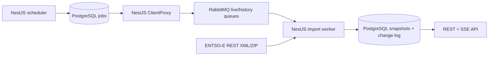

# Power Market Dashboard

Bun/Nx workspace with a NestJS API, a NestJS importer, PostgreSQL 17 and RabbitMQ.
The backend serves Hungarian solar forecasts/actuals and published aFRR/mFRR offer
ladders. Angular is intentionally unchanged.



## Local setup

```sh
bun install
cp apps/importer/.env.example apps/importer/.env
cp apps/api/.env.example apps/api/.env
docker compose up -d --wait
bun --env-file=apps/importer/.env run db:migrate
```

Put your ENTSO-E token in `apps/importer/.env`. Register for free on the
[Transparency Platform](https://transparency.entsoe.eu/) and follow the
[REST API access guide](https://transparencyplatform.zendesk.com/hc/en-us/articles/15692855254548-Sitemap-for-Restful-API-Integration).
Credentials stay on the server. The default database and RabbitMQ credentials in
Compose are only for local development.

Run in separate terminals:

```sh
bun nx serve api
bun nx serve importer
```

API: `http://localhost:3000/api`; importer: `http://localhost:3001/api`.
OpenAPI UI: `http://localhost:3000/api/docs`; JSON: `/api/docs-json`.
The existing importer `/api/entsoe/day-ahead-prices` endpoint still uses
`ENTSOE_DOMAIN` (default CZ). New solar/balancing imports always use Hungary,
`10YHU-MAVIR----U`.

| Environment | Purpose |
| --- | --- |
| `DATABASE_URL` | Required PostgreSQL connection for both applications/migrations |
| `RABBITMQ_URL` | Required AMQP connection for importer |
| `ENTSOE_SECURITY_TOKEN` | Private source token, importer only |
| `ENTSOE_API_URL` | Defaults to `https://web-api.tp.entsoe.eu/api` |
| `ENTSOE_TIMEOUT_MS` | Per-request timeout, default 30000 ms |
| `ENTSOE_DOMAIN` | Legacy day-ahead price endpoint only |
| `PORT` | API default 3000, importer default 3001 |
| `IMPORT_SCHEDULER_ENABLED` | Set `false` to disable automatic scheduling; dispatcher/worker still run |
| `RABBITMQ_QUEUE_PREFIX` | Default `market`; isolate independent deployments sharing a broker |

## Data and freshness

Source queries: solar forecast `A69/A01/B16`, actual `A75/A16/B16`, balancing bids
`A37/B74/A51` (aFRR) and `A37/B74/A47` (mFRR). Bids use `offset` pagination.
ZIP/XML validation, duplicate-page detection and atomic snapshot commits ensure
that partial downloads never replace a complete ladder.

The scheduler checks current windows every 15 seconds, including the previous
90 minutes for balancing bids and yesterday/today solar data plus tomorrow's
forecast. It initially imports seven completed UTC days and rechecks them every
six hours. A shared limiter allows at most one request per 350 ms, prioritizes
live work over history, and applies a shared cooldown for HTTP 429. Live and
historical queues have separate consumers. Run one importer scheduler and one API
instance for this initial deployment; independent importer processes do not share
the in-process rate limiter.

Target: additional source-API-to-REST/SSE latency under 30 seconds under normal
source response times and load. This is not a guarantee during outages, rate
limiting or initial backfill. ENTSO-E's publication delay is separate: balancing
bids have a submission deadline 30 minutes after the delivery period ends.
[Source publication semantics](https://transparencyplatform.zendesk.com/hc/en-us/articles/12826669342996-Balancing-energy-bids-GL-EB-12-3-B-C).

`sourceCreatedAt` is the source document timestamp and may describe export
creation; it is **not** a verified publication time. `fetchedAt` is when a complete
batch was received, `storedAt` when its snapshot was stored, and `checkedAt` records
the most recent check. `/api/data-status` exposes import timings and freshness.
Worker JSON logs include source fetch, queue wait and processing durations.

Snapshots retain revisions and original XML for changed data. Identical
normalized content does not create another snapshot/event; raw XML is deduplicated
by SHA-256. There is no automatic retention deletion. Monitor database growth,
queue age and dead-letter messages. All time storage is UTC; the market timezone
is `Europe/Budapest` (23/25-hour DST days are supported).

## API and visualization contracts

All timestamps include a timezone; ranges are end-exclusive and aligned to
15-minute delivery boundaries. Missing values are `null`, never inferred zeros.

```text
GET /api/solar?from=2026-09-27T00:00:00Z&to=2026-09-28T00:00:00Z
GET /api/balancing/ladder?at=2026-09-27T00:00:00Z&product=afrr&direction=up&productType=A04&currency=HUF&targetMw=100
GET /api/balancing/price-history?from=2026-09-27T00:00:00Z&to=2026-09-28T00:00:00Z&product=mfrr&direction=down&productType=A04&currency=HUF&targetMw=100
GET /api/data-status
GET /api/events
```

- Solar: two power lines (`actualMw`, `forecastMw`) and a deviation panel
  (`deviationMw = actual − forecast`, `deviationPercent`). A zero forecast has no
  percentage deviation. MAE/RMSE are duration-weighted over jointly covered
  intervals, and `coverage` reports their fraction of the requested range.
  Resolution uses a common coarser interval and requires complete input coverage.
  This compares the published day-ahead dataset, not an intraday forecasting model.
- Ladder: draw horizontal steps from `fromMw` to `toMw` at `price`. Upward bids
  sort ascending, downward descending. Volumes are positive magnitudes. Equal
  prices combine into one step. `targetPrice` is the price covering the requested
  positive cumulative MW; beyond available volume or with missing prices it is
  `null`. Price history plots that value against delivery time, without interpolation.
- Product, direction, source product type and currency are separate groups.
  `/data-status.groups` lists available values. `A04` denotes local offers; other
  product codes are retained as supplied. There is no currency conversion.
- Cancelled and explicitly unavailable bids are excluded from the curve. Unknown
  availability and complex bids are counted and their flags retained in `bids`.
  This is an analytical ordering of published offers, not an activation simulation;
  linked/exclusive constraints and cross-border clearing are not optimized.
- An upstream error preserves the last snapshot but marks the window incomplete.
  A successful no-data response produces an explicit no-data snapshot. `complete`
  describes downloaded/usable data, not proof that the TSO has published all bids.

Open SSE **before** the initial REST request. The `ready` event includes a cursor
and requests an initial refresh. `market-change` identifies dataset/range to
refetch. Reconnect using `Last-Event-ID` to replay committed changes. IDs are strings
(PostgreSQL bigint). The stream polls the transactional log every second, emits
15-second heartbeats, and sends `unavailable` before closing on database failure.
Configure reverse proxies to disable buffering and allow long-lived SSE requests.

## Database and migrations

The shared `DatabaseModule` uses `@nestjs/typeorm`, decorated entities and
injected repositories. Transactions use TypeORM's `EntityManager`; the importer
keeps its PostgreSQL advisory lock on a dedicated `QueryRunner` connection through
fetch and commit. `pg` is the PostgreSQL driver. Schema synchronization and
startup migrations are disabled; deploy migrations explicitly before starting
applications.

`typeorm.config.ts` and Nest share the same DataSource options. CLI commands run
with Node/ts-node (including legacy decorators and workspace aliases), invoked
through Bun scripts:

```sh
bun --env-file=apps/importer/.env run db:status
bun --env-file=apps/importer/.env run db:generate libs/database/src/lib/migrations/ChangeName
bun --env-file=apps/importer/.env run db:migrate
```

Review generated SQL and register each new migration class in
`libs/database/src/lib/data-source.ts`; explicit imports also include migrations
in bundled builds. TypeORM records applied versions in `typeorm_migrations`.

For a database initialized by the previous `node-pg-migrate` implementation, the
initial schema is unchanged. After verifying that the old initial migration was
fully applied, baseline it once with
`bun --env-file=apps/importer/.env run db:migrate --fake` before adding subsequent
migrations. Use this only for an existing matching schema; fresh databases need
the regular migration command.

## Operations and recovery

```sh
# UTC day range, exclusive end; low-priority jobs, no direct external fetch
bun --env-file=apps/importer/.env run import:history 2026-09-01 2026-09-08

# Explicit schema rollback (removes market tables/data for this migration)
bun --env-file=apps/importer/.env run db:rollback
```

Messages are persistent and publisher-confirmed. Consumers ACK after commit.
Retryable failures use up to five attempts with exponential backoff and
`Retry-After`; permanent failures go to `<prefix>.import.dead`. PostgreSQL job state
is retained. Stalled published/running jobs are redispatched after five minutes;
session advisory locks prevent concurrent processing of the same data window.
After resolving a permanent failure, re-enqueue its date range using the CLI.
Do not automatically drain a dead-letter queue back into the live queue.

Health/status checks: `/api` confirms process availability; `/api/data-status`
checks PostgreSQL and reports dataset import state. RabbitMQ management is at
`http://localhost:15672`. Monitor broker connectivity, oldest live-job age, repeated
source failures, `fetchMs`/`queueMs`/`processingMs`, and disk growth. Source tokens
and full Axios error objects are never logged.

## Verification

```sh
bun nx run-many -t lint -p api importer market database api-e2e importer-e2e
bun nx run-many -t test -p api importer market database
bun nx run-many -t build -p api importer --configuration=production
bun nx run-many -t e2e -p api-e2e importer-e2e
```

E2E tests use Compose services by default. Override `TEST_DATABASE_URL` and
`TEST_RABBITMQ_URL` if needed. The database user must be able to create/drop test
databases. Each suite creates and removes its own random database; importer tests
also use isolated RabbitMQ queue names and a local HTTP source. Tests never call
ENTSO-E or use the private token. XML fixtures are synthetic examples of the
verified source format. Integration scenarios cover migration rollback, atomic
pagination, duplicate delivery, retries, worker restart, SSE resume and the
30-second target against the controlled source.
